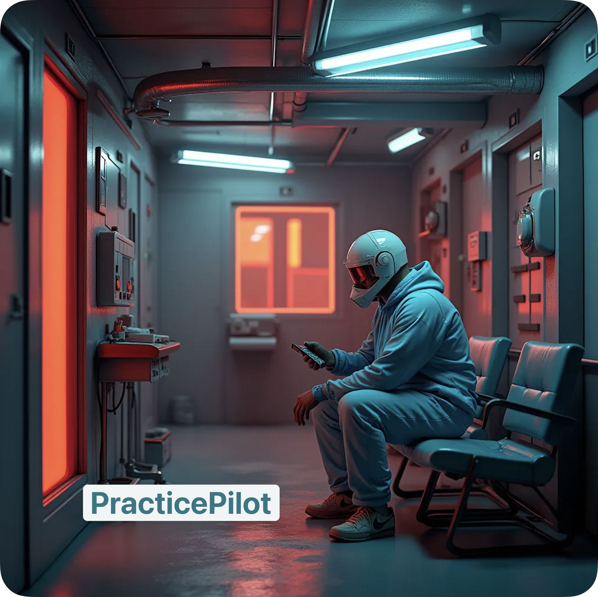

# PracticePilot 🩺✨

**A Streamlit-Powered RAG System for Practice Managers in Brompton Health PCN**

**PracticePilot** is a streamlined web app tailored to the needs of Practice Managers at Brompton Health PCN. Built using Streamlit, it leverages **Retrieval-Augmented Generation (RAG)** to deliver actionable insights, enhance operational efficiency, and support better decision-making. With its user-friendly interface and robust backend, PracticePilot simplifies complex management tasks and ensures optimal clinic performance.

## 🌟 Features
1.	**AI-Powered Knowledge Retrieval**
	•	Instantly fetch precise answers to queries about clinic operations, HR policies, and patient care protocols.
	•	Combines a curated knowledge base with dynamic AI-generated insights.
2.	**Customizable Knowledge Base**
	•	Update and manage a centralized repository of guidelines, local policies, and NHS documents directly within the app.
3.	**Interactive Task Management**
	•	Generate AI recommendations for staff scheduling, compliance checks, and operational planning.
4.	**Secure & Compliant**
	•	Ensures full compliance with GDPR and NHS data security standards, making it safe for healthcare environments.
5.	**Streamlit Simplicity**
	•	Intuitive and fast deployment with the flexibility to scale as needed.

## 🚀 Getting Started

### Prerequisites
•	Python: v3.8 or higher
•	Streamlit: v1.15 or higher
•	OpenAI API Key: Required for GPT-based RAG functionality

## 🏥 Key Use Cases
•	**Quick Policy Lookup**: Retrieve NHS or Brompton Health PCN guidelines in seconds.
•	**Operational Planning**: Generate AI-driven insights for scheduling, compliance, and resource allocation.
•	**HR Support**: Resolve staff-related queries and streamline communication.
•	**Patient Care Enhancement**: Provide data-backed recommendations for improving patient outcomes.

## 🛡️ License

This project is licensed under the MIT License. See the LICENSE file for details.

## 💬 Feedback

Your feedback is invaluable! Reach out to us via:
	•	Email: drjanduplessis@icloud.com
	•	Issues: Submit bugs or feature requests here.

### 🤝 Acknowledgments
•	Brompton Health PCN: For their guidance and support.
•	Streamlit Community: For the tools and inspiration.
•	OpenAI: For enabling the RAG architecture.

**Start using PracticePilot today!** 🚀
